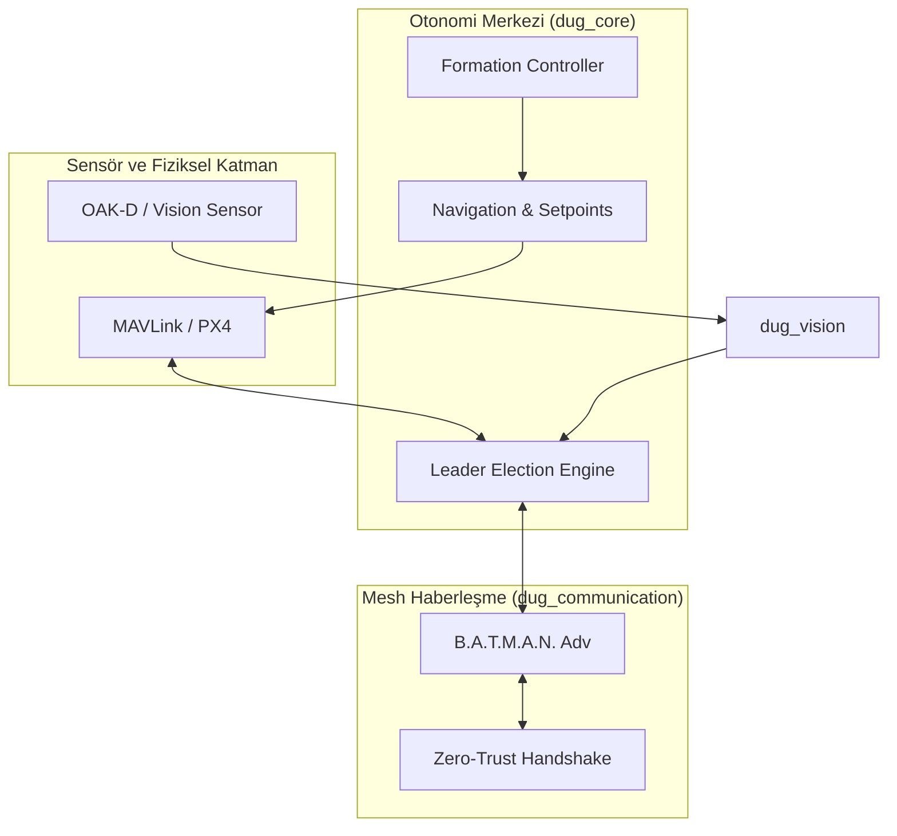

<p align="center">
  
</p>

# 🛸 Decentralized UAV Grid (DUG)


**Decentralized UAV Grid (DUG)**, yüzlerce veya binlerce insansız hava aracının (İHA) herhangi bir merkezi sunucuya, karargaha veya baz istasyonuna ihtiyaç duymadan, kendi aralarında P2P (Peer-to-Peer) ve Mesh (Ağ) topolojileri üzerinden haberleşerek otonom şekilde görev yapmasını sağlayan bir sürü zekası (swarm intelligence) altyapısıdır.

---

## 🇹🇷 Türkiye'nin "Topyekûn Savunma" Vizyonuna Katkımız

DUG, Türkiye'nin **81 İlde Drone Seferberliği** ve yeni **Topyekûn Savunma** konseptine sivil Ar-Ge ekosisteminden sunulan stratejik bir teknolojidir. 

### Temel Stratejik Sütunlar
*   **Asimetrik Güç Çarpanı:** Hantal ve pahalı tekil platformlar yerine, ucuz ve koordinatlı binlerce platformun oluşturduğu "sürü" etkisi.
*   **Dağıtık Üretim:** Farklı atölyelerde üretilen İHA'ların tek bir ağda "tak-çalıştır" (plug-and-play) mantığıyla entegre olması.
*   **Elektronik Harp Dayanımı:** Tek bir sinyal kulesine bağımlı olmayan, kendi iç haberleşmesini dinamik olarak rotalayan mesh yapısı sayesinde Jammer direnci.

---

## 🏗 Sistem Mimarisi ve Veri Akışı

Mimarimiz, donanım katmanından otonomi katmanına kadar **sıfır-merkeziyet (zero-centrality)** prensibiyle tasarlanmıştır.

### 1. Katmanlı Mimari (UAV Edge-Node)



---

## 📦 Paket Ekosistemi

| Paket | Katman | Teknoloji | Detaylı Görev |
| :--- | :--- | :--- | :--- |
| `dug_msgs` | **Interface** | ROS2 IDL | SwarmState, TargetInfo ve FormationState gibi sürü-özel mesaj tipleri. |
| `dug_core` | **Logic** | C++ 17 | Sürü lideri seçimi, formasyon matematiği ve görev dağıtımı. |
| `dug_vision` | **Perception** | Py / AI | YOLO/TensorRT tabanlı hedef tespiti ve 3D koordinat kestirimi. |
| `dug_communication` | **Networking** | Python / Mesh | P2P el sıkışma, ağ topolojisi izleme ve şifreli veri aktarımı. |
| `dug_simulation` | **Testing** | Gazebo | Çoklu PX4 SITL araçlarının ve ROS2 düğümlerinin koordinasyonu. |

---

## 🧠 Temel Algoritmalar

### A. Dinamik Lider Seçimi (Self-Healing Election)
Sürüde her İHA, bir "Aday" (Candidate) olarak başlar. Liderlik kriterleri şunlardır:
1.  **Pil Sağlığı ($B_i$):** En yüksek enerji rezervine sahip olan önceliklidir.
2.  **Bağlantı Derecesi ($C_i$):** Mesh ağında en fazla komşuya (peer) doğrudan erişimi olan.
3.  **Donanım Yükü ($L_i$):** CPU/GPU kullanım oranı en düşük olan.

**Matematiksel Skor:** $Score_i = w_1 B_i + w_2 C_i - w_3 L_i$
*Eğer mevcut liderin skoru kritik eşiğin altına düşerse, yeni seçim milisaniyeler içinde gerçekleşir.*

### B. Formasyon Matematiği (Relative Offsets)
Takipçiler, liderin $P_{leader}$ konumuna göre kendi yerel ofsetlerini ($O_{uav\_id}$) hesaplar:
$P_{cmd} = P_{leader} + R(\psi) \cdot O_{uav\_id}$
Burada $R(\psi)$, liderin yönelimine (heading) göre dönme matrisidir.

---

## 🛡 Zero-Trust ve Siber Güvenlik

Merkeziyetsiz ağlarda "içeriden saldırı" (Insider Threat) en büyük risktir. DUG bunu şu şekilde engeller:
*   **Handshake:** Her veri paketi, gönderici İHA'nın benzersiz imzasıyla doğrulanır.
*   **Outlier Detection:** Sürü ortalamasından sapan (örneğin aniden saçma koordinatlar bildiren) düğümler, ağ tarafından otomatik olarak "izole" edilir.

---

## 🚀 Donanım ve Saha Kurulumu

### Minimum Gereksinimler
*   **SBC:** Nvidia Jetson Nano / Orin Nano (Görü işleme için önerilir).
*   **Flight Controller:** Pixhawk v5+ veya Cube Orange.
*   **Mesh Adaptör:** 802.11s destekli Wi-Fi kartları (Atheros çipsetli önerilir).

### Yazılım Kurulumu
```bash
# Bağımlılıklar ve ROS2 Humble Kurulumu
chmod +x scripts/setup_env.sh
./scripts/setup_env.sh

# Workspace Derleme
colcon build --symlink-install
source install/setup.bash
```

---

## 🧪 Simülasyon ve Validasyon

Sistemi 10 adet İHA ile Gazebo üzerinde test etmek için:
```bash
ros2 launch dug_simulation tactical_swarm.launch.py drone_count:=10
```

**Gözlemlenecek Parametreler:**
*   `ros2 topic echo /swarm/status`: Sürü üyelerinin sağlık durumu.
*   `ros2 topic echo /swarm/targets`: Senkronize edilmiş küresel hedef listesi.

---

## 🗺 Yol Haritası (Roadmap)

- [x] **Faz 1:** Merkeziyetsiz haberleşme ve lider seçimi.
- [x] **Faz 2:** Dinamik formasyon ve hedef senkronizasyonu.
- [x] **Faz 3:** Engelden kaçınma (Obstacle Avoidance) ve VFH+ algoritması.
- [ ] **Faz 4:** GNSS-Denied ortamlarda görsel navigasyon (SLAM).
- [ ] **Faz 5:** Kamikaze ve mühimmat bırakma modülleri entegrasyonu.

---

## 📚 Kaynakça, Literatür ve Ekosistem

Decentralized UAV Grid (DUG), dünya genelindeki sürü robotiği literatürü ve endüstriyel standartlar üzerine inşa edilmiştir. Bu bölüm, projenin dayandığı derin teknik kökleri ve benzer çalışmaları detaylandırır.

### 1. Sürü Zekası ve Kontrol Algoritmaları (SOTA)
Projedeki lider seçimi ve formasyon kontrolü, aşağıdaki akademik yaklaşımlardan ilham almıştır:
*   **Reynolds' Boids (Flocking):** Sürü hareketinin üç temel kuralı (Ayrılma, Hizalanma, Birleşme) üzerine kurulu temel model. [Craig Reynolds, 1987]
*   **Consensus-Based Bundle Algorithm (CBBA):** Merkezi olmayan görev dağıtımı ve açık artırma usulü hedef paylaşımı için kullanılan standart algoritma.
*   **Artificial Potential Fields (APF):** Engelden kaçınma ve sürü içi çarpışma önleme için kullanılan vektörel alan matematiği.
*   **Fast-Planner / Ego-Planner:** ZJU FAST Lab tarafından geliştirilen, kısıtlı donanımlarda gerçek zamanlı yörünge planlama algoritmaları.

### 2. Simülasyon ve Validasyon Platformları
DUG, geliştirme sürecinde farklı simülasyon derinliklerinden faydalanır:
*   **Gazebo Classic & Ignition:** Fiziksel motoru ve ROS2 entegrasyonu ile sürü testlerinin ana merkezi.
*   **PX4 SITL (Software In The Loop):** Uçuş kontrol yazılımının (firmware) birebir kodunun bilgisayarda koşturulması.
*   **AirSim (Microsoft):** Fotogerçekçi ortamlar ve derin öğrenme (dug_vision) eğitimleri için yüksek kaliteli veri seti üretim alanı.
*   **Flightmare:** Çok yüksek hızlı (agile) uçuşlar ve sürü dinamikleri için özelleşmiş simülatör.

### 3. Haberleşme ve Mesh Topolojileri
Merkeziyetsiz ağ yapısının teknik referansları:
*   **MAVLink Protokolü:** İHA dünyasının ortak dili. Mikro-servis mimarisi ile veri paketleme.
*   **DDS (Data Distribution Service):** ROS2'nin omurgasını oluşturan, düşük gecikmeli ve gerçek zamanlı veri dağıtım katmanı.
*   **IEEE 802.11s:** Wi-Fi mesh ağları için endüstriyel standart. B.A.T.M.A.N. Adv ile kernel seviyesinde entegrasyon.
*   **FastDDS & CycloneDDS:** Sürü içi yüksek bant genişliği yönetimi için optimize edilmiş DDS implementasyonları.

### 4. Küresel ve Yerel Sürü Projeleri
*   **NASA SWARM (Swarmie):** Uzay araştırmaları ve kaynak toplama için geliştirilen dağıtık robot sürüleri.
*   **Bitcraze Crazyswarm:** Kapalı alanlarda (Vicon/Optitrack altında) 49+ drone ile yapılan senkronize uçuş çalışmaları.
*   **Bitbeamon Swarm:** Endüstriyel denetimler için mesh ağlı drone çözümleri.
*   **Türkiye Ekosistemi:**
    *   **Baykar & TUSAŞ:** Kızılelma, Akıncı ve ANKA-3 projelerindeki "kol uçuşu" ve "sadık kanat adamı" (Loyal Wingman) konseptleri.
    *   **TEKNOFEST Teknik Şartnameleri:** Türkiye'deki sürü İHA çalışmalarının teknik olgunluk seviyesini belirleyen temel dökümantasyon seti.

### 5. Eğitim ve Topluluk Kaynakları
*   **PX4/Auterion Dev Summit:** Yıllık düzenlenen teknik konferanslar ve sunumlar.
*   **ETH Zurich - IDSC:** Prof. Raffaello D'Andrea'nın sürü dinamikleri üzerine öncü dersleri.
*   **University of Pennsylvania - GRASP Lab:** Vijay Kumar'ın mikro-İHA sürüleri üzerine çalışmaları.

### 6. Açık Kaynak Kod Repoları ve Teknik Raporlar
Sürü zekası ve merkeziyetsiz kontrol mekanizmalarını derinlemesine incelemek için aşağıdaki repolar ve raporlar "altın standart" kabul edilir:

*   **[ZJU-FAST-Lab / EGO-Swarm](https://github.com/ZJU-FAST-Lab/EGO-Swarm):** Merkeziyetsiz sürü navigasyonu için dünyadaki en popüler ve gelişmiş repolardan biridir.
*   **[USC-ACTLab / Crazyswarm](https://github.com/USC-ACTLab/crazyswarm):** Yüzlerce drone'un senkronize uçuşu için Python/ROS tabanlı kapsamlı bir framework.
*   **[SinuoLiu / Swarm-RL](https://github.com/SinuoLiu/Swarm-RL):** Takviyeli öğrenme (Reinforcement Learning) ile sürü kontrolü üzerine derinlemesine kodlar.
*   **[PX4 / Swarm-Obstacle-Avoidance](https://github.com/PX4/PX4-Avoidance):** Sürü içi ve dışı engellerden kaçınma için PX4 resmi algoritmaları.
*   **[Technical Report: DARPA OFFSET](https://www.darpa.mil/program/offensive-swarm-enabled-tactics):** Kentsel operasyonlar için sürü taktikleri ve operasyonel dökümantasyon.
*   **[B.A.T.M.A.N. Adv Whitepaper](https://www.open-mesh.org/projects/batman-adv/wiki/Docu):** Mesh ağlarının teorik temelleri ve yönlendirme protokolü teknik raporu.

---

## 🤝 Katkıda Bulunma

Bu proje Türkiye'nin teknolojik bağımsızlığına katkı sunmayı amaçlayan bir Ar-Ge çalışmasıdır. Katkılarınız için `CONTRIBUTING.md` dosyasına göz atın.

## 📄 Lisans

Decentralized UAV Grid (DUG) **MIT Lisansı** ile korunmaktadır.