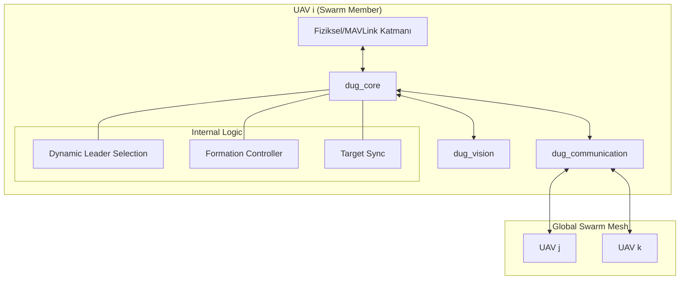

<p align="center">
  
</p>

# 🛸 Decentralized UAV Grid (DUG)


**Decentralized UAV Grid (DUG)**, yüzlerce veya binlerce insansız hava aracının (İHA) herhangi bir merkezi sunucuya, karargaha veya baz istasyonuna ihtiyaç duymadan, kendi aralarında P2P (Peer-to-Peer) ve Mesh (Ağ) topolojileri üzerinden haberleşerek otonom şekilde görev yapmasını sağlayan bir sürü zekası (swarm intelligence) altyapısıdır.

Geleneksel havacılık sistemlerindeki "Merkez-Uç" (Hub-and-Spoke) mimarileri, komuta merkezinin veya iletişim kulesinin vurulması durumunda tüm filonun çökmesine yol açan büyük bir zafiyet barındırır. DUG, bu asimetrik tehdidi ortadan kaldırarak; bir veya birden fazla aracın yok olması durumunda dahi kendi kendini onaran (self-healing), kesintisiz ve merkeziyetsiz bir ağ sunar.

---

## 🇹🇷 Türkiye'nin "Topyekûn Savunma" Vizyonuna Katkımız

DUG, salt bir yazılım projesi olmanın ötesinde; Türkiye'nin son dönemde uygulamaya koyduğu **81 İlde Drone Seferberliği** ve yeni **Topyekûn Savunma** konseptine sivil Ar-Ge ekosisteminden sunulan stratejik bir teknoloji konseptidir. 

*   **Dağıtık Üretim ve Operasyon Sinerjisi:** 81 ile dağıtılan üretim tesislerinden çıkacak farklı tipteki droneların tek bir standart ağ üzerinde birbirlerini tanıyarak ortak hareket edebilmesi.
*   **Kısıtlı Donanımda Maksimum Otonomi (Edge-AI):** DUG, veri işleme yükünü optimize ederek algoritmaların uç cihazlarda (Nvidia Jetson, Raspberry Pi vb.) çalışmasını sağlar.
*   **Elektronik Harp (EH) Direnci:** Ağa dışarıdan gelen verilere güvenmeyen "Zero-Trust" yaklaşımı ve dinamik mesh routing ile Jammer etkilerine karşı dayanıklılık.

---

## 🏗 Sistem Mimarisi

Mimari yapı, donanımdan bağımsız çalışabilmesi için ROS2 (Robot Operating System) üzerinde modüler olarak tasarlanmıştır:

### Katmanlı Yapı (Cross-Node Communication)



---

## 📦 Paket Tanımları ve Özellikleri

| Paket | Teknoloji | Temel Görevler |
| :--- | :--- | :--- |
| `dug_msgs` | ROS2 Interfaces | `SwarmState`, `TargetInfo`, `FormationState` mesaj tanımları. |
| `dug_core` | C++ 17 | Lider seçimi, Diamond formasyon kontrolü, Görev senkronizasyonu. |
| `dug_vision` | Python / OpenCV | Gerçek zamanlı hedef tespiti ve koordinat kestirimi. |
| `dug_communication` | Python / B.A.T.M.A.N. | Zero-Trust el sıkışma, Mesh ağ sağlığı takibi. |
| `dug_simulation` | ROS2 Launch | Gazebo & PX4 SITL tabanlı çoklu İHA test ortamı. |

---

## 🧠 Gelişmiş Özellikler (Advanced Features)

### 1. Dinamik Formasyon Kontrolü
Lider seçilen İHA, sürünün geri kalanına formasyon tipini (`Diamond`, `Square`, `V-Shape`) yayınlar. Takipçi İHA'lar, liderin konumuna göre kendi ID'lerini kullanarak dinamik ofset hesaplar:
*   **Ofset Hesabı:** `x_cmd = leader_x + offset_x(id)`, `y_cmd = leader_y + offset_y(id)`
*   **Offboard Kontrol:** Hesaplanan koordinatlar MAVROS üzerinden doğrudan uçuş denetleyicisine iletilir.

### 2. Zero-Trust Handshake (Güvenli Katılım)
Ağa katılan her yeni düğüm, `dug_communication` tarafından bir doğrulama sürecinden geçirilir:
*   **Verification:** Sadece önceden tanımlanmış kriptografik anahtarlara veya ID aralıklarına sahip düğümler "Trusted" statüsü alır.
*   **Isolation:** Güvenilmeyen düğümlerden gelen konum veya hedef verileri sürü tarafından reddedilir.

### 3. Dağıtık Hedef Takibi (Distributed Tracking)
Sürüdeki tek bir İHA'nın hedef tespit etmesi, tüm sürünün o hedefi "görmesi" demektir.
*   **Sync Logic:** Tespit edilen hedefler `/swarm/targets` kanalından yayınlanır ve her İHA kendi yerel listesini günceller.

---

## 🚀 Donanım Gereksinimleri (Önerilen)

*   **Uçuş Bilgisayarı:** Nvidia Jetson Orin Nano veya Raspberry Pi 4/5.
*   **Uçuş Denetleyicisi:** Pixhawk 6C / Orange Cube (PX4 veya ArduPilot yazılımı ile).
*   **Haberleyme:** Alfa AWUS036ACM (Mesh destekli Wi-Fi adaptörü) veya RF Mesh modemler.
*   **Sensörler:** OAK-D Lite (Derinlik kameralı hedef tespiti için).

---

## 🛠 Kurulum ve Çalıştırma

### Bağımlılıkların Kurulumu
Sistemi hazır hale getirmek için Ubuntu 22.04 üzerinde:
```bash
git clone https://github.com/arch-yunus/decentralized-uav-grid.git
cd decentralized-uav-grid
chmod +x scripts/setup_env.sh
./scripts/setup_env.sh
```

### Derleme ve Başlatma
```bash
colcon build --symlink-install
source install/setup.bash

# 10 İHA'lı sürü simülasyonu
ros2 launch dug_simulation tactical_swarm.launch.py drone_count:=10
```

---

## 🧪 Test Senaryoları

1.  **Lider Kaybı Testi:** Simülasyonda lider İHA'nın düğümünü (node) kapatın. Takipçilerin milisaniyeler içinde yeni bir lider seçtiğini gözlemleyin.
2.  **Formasyon Testi:** Liderin konumunu değiştirin, takipçilerin Diamond dizilimini koruyarak lideri takip ettiğini doğrulayın.
3.  **Hedef Paylaşımı:** Bir İHA'nın kamerasından (veya mock verisinden) hedef bilgisi girin, tüm İHA loglarında "New global target synchronized" mesajını kontrol edin.

---

## 🗺 Geliştirme Yol Haritası (Roadmap)

- [x] **Faz 1:** Merkeziyetsiz lider seçimi ve temel mesh haberleşmesi.
- [x] **Faz 2:** Dinamik formasyon ve sürü hedef senkronizasyonu.
- [ ] **Faz 3:** Engelden kaçınma (Obstacle Avoidance) ve VFH+ entegrasyonu.
- [ ] **Faz 4:** LTE/5G üzerinden geniş alan mesh köprüleme.

---

## 🤝 Katkıda Bulunma

Proje akademik ve endüstriyel katkılara açıktır. Lütfen `CONTRIBUTING.md` dosyasını inceleyin.

## 📄 Lisans

Bu proje **MIT Lisansı** ile lisanslanmıştır. Akademik atıf yapılması önerilir.